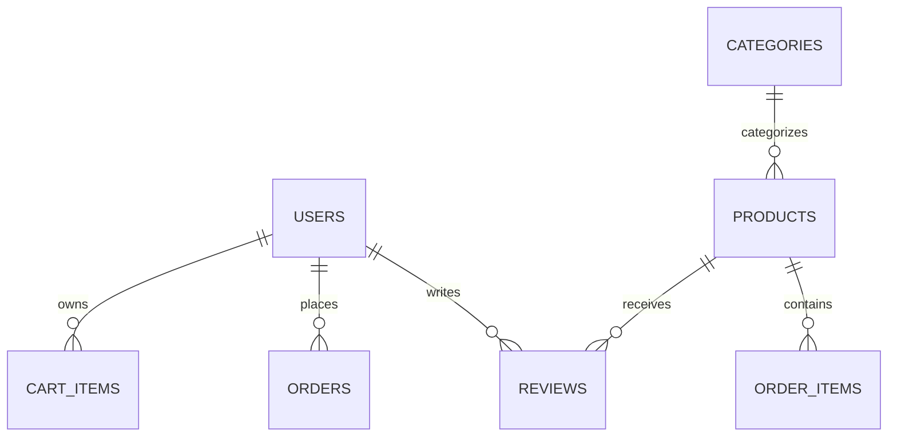

# Baking E-Commerce Backend: System Architecture & API Documentation 🎂

This document provides a comprehensive overview of the design, database schemas, core business logic, and API endpoints for the Baking E-Commerce Backend system.

---

## 🏗️ 1. System Architecture & Tech Stack

The system is designed as a modular, lightweight, asynchronous API service using:
1. **FastAPI (Python 3.11+):** High-performance web framework utilizing python's asynchronous features.
2. **MongoDB & Motor:** Document-based NoSQL database using Motor (an async driver for MongoDB) to prevent blocking database calls.
3. **PyJWT (python-jose):** Generates and decodes JSON Web Tokens (JWT) for secure session authentication.
4. **Bcrypt:** Securely hashes passwords directly in the app context to ensure security.
5. **Static File Server:** Uses FastAPI `StaticFiles` to serve uploaded product images locally from the `/uploads` folder.

### Directory Structure & Responsibilities

- **`app/main.py`:** Configures settings, mounts static paths (images), establishes startup/shutdown lifespans, and serves root/health endpoints.
- **`app/core/`:** Contains application config definitions (`config.py`) and authentication primitives (`security.py`).
- **`app/database/`:** Connects to the local/remote MongoDB instance via Motor and exports the async database client (`connection.py`).
- **`app/api/deps.py`:** Implements FastAPI dependencies (`Depends`) to extract and validate JWT tokens, load current users, and check roles (Admin vs Customer).
- **`app/schemas/`:** Contains Pydantic models mapping validation rules for JSON inputs and outputs.
- **`app/models/`:** Houses direct MongoDB data access objects (DAO) and helper queries.
- **`app/api/v1/`:** Exposes endpoint routes separated by business resource.

---

## 🗄️ 2. Database Schema Design

The application uses 6 collections inside MongoDB. Documents are identified using MongoDB's default 12-byte `ObjectId` mapped in the schemas as `validation_alias="_id"` and serialized as a string `id`.



### Collection Schemas

#### 1. `users`
Represents customer and administrator accounts.
```json
{
  "_id": "ObjectId",
  "email": "string (unique)",
  "username": "string (unique)",
  "hashed_password": "string",
  "full_name": "string or null",
  "is_active": "boolean (default: true)",
  "is_admin": "boolean (default: false)",
  "created_at": "ISODate",
  "updated_at": "ISODate"
}
```

#### 2. `categories`
Groups products together.
```json
{
  "_id": "ObjectId",
  "name": "string (unique)",
  "description": "string or null"
}
```

#### 3. `products`
Available baking items.
```json
{
  "_id": "ObjectId",
  "name": "string",
  "description": "string",
  "price": "double",
  "sku": "string (unique)",
  "category_id": "string (Category ObjectId)",
  "stock_quantity": "int",
  "images": ["string (image urls)"],
  "is_active": "boolean (default: true)",
  "average_rating": "double (default: 0.0)",
  "created_by": "string (User ObjectId)",
  "created_at": "ISODate",
  "updated_at": "ISODate"
}
```

#### 4. `cart`
Active shopping session items.
```json
{
  "_id": "ObjectId",
  "user_id": "string (User ObjectId)",
  "product_id": "string (Product ObjectId)",
  "quantity": "int",
  "added_at": "ISODate"
}
```

#### 5. `orders`
Logs final purchase checkouts.
```json
{
  "_id": "ObjectId",
  "user_id": "string (User ObjectId)",
  "status": "string (pending | confirmed | shipped | delivered | cancelled)",
  "total_amount": "double",
  "shipping_address": {
    "street": "string",
    "city": "string",
    "state": "string",
    "postal_code": "string",
    "country": "string"
  },
  "order_items": [
    {
      "product_id": "string (Product ObjectId)",
      "quantity": "int",
      "price": "double"
    }
  ],
  "created_at": "ISODate",
  "updated_at": "ISODate"
}
```

#### 6. `reviews`
Product feedback.
```json
{
  "_id": "ObjectId",
  "product_id": "string (Product ObjectId)",
  "user_id": "string (User ObjectId)",
  "rating": "int (1-5)",
  "comment": "string or null",
  "created_at": "ISODate",
  "updated_at": "ISODate"
}
```

---

## ⚙️ 3. Core Workflows & Business Logic

### A. Authentication Flow
1. **Registration:** Password is encrypted using `bcrypt.hashpw` before writing the user document.
2. **Login:** Takes standard form fields, validates password against `bcrypt.checkpw`, and returns a JWT token with the user's `_id` set in the token payload sub field (`sub`).
3. **Session Verification:** API endpoints fetch the Bearer token from the `Authorization` header, decode it using the server's `SECRET_KEY`, extract the `sub` ID, and load the user from the database.

### B. Cart Addition & Checkout Flow
1. When adding to cart, the system checks if the product is active and if the requested quantity is available in stock.
2. Checkout reads all cart items for the user, re-verifies inventory levels, sums up prices, creates an `order` document, reduces the product `stock_quantity` by the corresponding quantities, and finally clears the cart items.

### C. Order Cancellation Flow
Customers can cancel a **pending** order. Cancelling will update the order status to `cancelled` and return all the purchased item quantities back into the corresponding products' `stock_quantity`.

### D. Purchase-Validated Review & Rating Flow
1. When a user writes a review, the system queries the `orders` collection to verify the user has a successfully checked-out order containing that specific `product_id`. If not, it blocks the review (returns `403 Forbidden`).
2. After a review is added, updated, or deleted, an async aggregation pipeline runs on the `reviews` collection to compute the average rating of that product:
   $$\text{Average Rating} = \frac{\sum \text{Ratings}}{\text{Total Reviews}}$$
   The calculated average is written back to the product's `average_rating` field in the database. If all reviews are deleted, the rating resets to `0.0`.

---

## 🔌 4. Detailed Endpoint & API Reference

### 🔐 Authentication (`/api/v1/auth`)

#### Register User
* **Method/Path:** `POST /api/v1/auth/register`
* **Auth Requirement:** None
* **Request JSON:**
  ```json
  {
    "email": "user@example.com",
    "username": "baker123",
    "password": "securepassword",
    "full_name": "Jane Doe"
  }
  ```
* **Logic:** Checks if the email or username is already taken. If clean, encrypts the password and saves a user document.
* **Success Response (201 Created):** Returns user details with password excluded.

#### Login
* **Method/Path:** `POST /api/v1/auth/login`
* **Auth Requirement:** None
* **Request Body:** Form parameters `username` and `password` (standard OAuth2 format).
* **Logic:** Looks up the username. Verifies password hash.
* **Success Response (200 OK):**
  ```json
  {
    "access_token": "eyJhbGciOi...",
    "token_type": "bearer"
  }
  ```
* **Error Response (401 Unauthorized):** Incorrect username or password.

#### Get Current Profile
* **Method/Path:** `GET /api/v1/auth/me`
* **Auth Requirement:** Bearer Token
* **Success Response (200 OK):** Returns current user details.

---

### 🎂 Public Product Catalog (`/api/v1/products`)

#### Browse & Search Products
* **Method/Path:** `GET /api/v1/products/`
* **Auth Requirement:** None
* **Query Parameters:**
  - `skip` (int): Offset for pagination (default: 0).
  - `limit` (int): Number of items (default: 10).
  - `category_id` (string): Filter by category ID.
  - `search` (string): Text search across name and description (case-insensitive regex).
  - `min_price` (float) / `max_price` (float): Price range bounds.
* **Logic:** Searches the database for active (`is_active: true`) products matching criteria.
* **Success Response (200 OK):** JSON list of products.

#### Browse Categories
* **Method/Path:** `GET /api/v1/products/categories`
* **Auth Requirement:** None
* **Success Response (200 OK):** Lists all created categories.

#### Read Product Details
* **Method/Path:** `GET /api/v1/products/{product_id}`
* **Auth Requirement:** None
* **Success Response (200 OK):** Details of the single product.
* **Error Response (404 Not Found):** Product is inactive or does not exist.

---

### 🛒 Customer Shopping Cart (`/api/v1/cart`)

#### Add Item to Cart
* **Method/Path:** `POST /api/v1/cart/add`
* **Auth Requirement:** Customer Token
* **Request JSON:**
  ```json
  {
    "product_id": "60d5f1...",
    "quantity": 2
  }
  ```
* **Logic:** Checks stock availability. Adds a cart document or increases quantity if item already exists in the cart.
* **Success Response (201 Created):** Returns cart item.

#### View Cart Items
* **Method/Path:** `GET /api/v1/cart/`
* **Auth Requirement:** Customer Token
* **Success Response (200 OK):** List of cart items for the current user.

#### Update Cart Quantity
* **Method/Path:** `PUT /api/v1/cart/update/{item_id}`
* **Auth Requirement:** Customer Token
* **Request JSON:** `{"quantity": 5}`
* **Success Response (200 OK):** Updated cart item.

#### Remove Item from Cart
* **Method/Path:** `DELETE /api/v1/cart/remove/{item_id}`
* **Auth Requirement:** Customer Token
* **Success Response (204 No Content):** Item removed from cart.

---

### 📦 Customer Orders (`/api/v1/orders`)

#### Place Order (Checkout)
* **Method/Path:** `POST /api/v1/orders/`
* **Auth Requirement:** Customer Token
* **Request JSON:**
  ```json
  {
    "shipping_address": {
      "street": "123 Baker St",
      "city": "Mumbai",
      "state": "Maharashtra",
      "postal_code": "400001",
      "country": "India"
    }
  }
  ```
* **Logic:** Verifies stock for all items, decreases product counts, registers a new order document with status `pending`, and empties the cart.
* **Success Response (201 Created):** Order summary.

#### Read Order History
* **Method/Path:** `GET /api/v1/orders/`
* **Auth Requirement:** Customer Token
* **Success Response (200 OK):** List of orders placed by the user.

#### Cancel Order
* **Method/Path:** `POST /api/v1/orders/{order_id}/cancel`
* **Auth Requirement:** Customer Token
* **Logic:** Verifies the order is still `pending` and owned by the request user. Updates status to `cancelled` and restores item inventory.
* **Success Response (200 OK):** Cancelled order details.

---

### ⭐ Reviews & Ratings (`/api/v1/reviews`)

#### Add Review
* **Method/Path:** `POST /api/v1/reviews/`
* **Auth Requirement:** Customer Token
* **Request JSON:**
  ```json
  {
    "product_id": "60d5f1...",
    "rating": 5,
    "comment": "Absolutely beautiful!"
  }
  ```
* **Logic:** Checks if the user has purchased the product. Saves review, triggers product rating update.
* **Success Response (201 Created):** Created review details.

#### List Reviews for Product
* **Method/Path:** `GET /api/v1/reviews/product/{product_id}`
* **Auth Requirement:** None
* **Success Response (200 OK):** List of reviews for the product.

#### Delete Review
* **Method/Path:** `DELETE /api/v1/reviews/{review_id}`
* **Auth Requirement:** Author / Admin Token
* **Success Response (204 No Content):** Review deleted. Triggers product rating update.

---

### 🛠️ Admin Management (`/api/v1/admin`)

These endpoints require authentication with a user that has `is_admin: true` in the database.

#### Categories CRUD
* **Create Category:** `POST /api/v1/admin/categories`
  * Body: `{"name": "...", "description": "..."}`
* **List Categories:** `GET /api/v1/admin/categories`
* **Get Category:** `GET /api/v1/admin/categories/{category_id}`
* **Delete Category:** `DELETE /api/v1/admin/categories/{category_id}`
  * *Constraint:* Prevents deletion if any products are still cataloged under the category. Returns `400 Bad Request`.

#### Products CRUD
* **Create Product:** `POST /api/v1/admin/products`
  * Body: `{"name": "...", "description": "...", "price": ..., "sku": "...", "category_id": "...", "stock_quantity": ...}`
* **List All Products:** `GET /api/v1/admin/products` (returns active and inactive products)
* **Update Product:** `PUT /api/v1/admin/products/{product_id}`
* **Delete Product:** `DELETE /api/v1/admin/products/{product_id}`

#### Image Management
* **Upload Image:** `POST /api/v1/admin/products/{product_id}/images`
  * Body: `Multipart/form-data` with `file` upload.
  * Validation: Limit 5MB. Formats allowed: `.jpg`, `.jpeg`, `.png`, `.webp`.
  * Logic: Generates unique UUID filename, writes file to `/uploads`, appends URL `/static/{filename}` to product images array.
* **Delete Image:** `DELETE /api/v1/admin/products/{product_id}/images/{filename}`
  * Logic: Removes string matching `/static/{filename}` from product images array, deletes local `/uploads/{filename}` file.

#### Orders & Analytics
* **List Customer Orders:** `GET /api/v1/admin/orders`
* **Update Order Status:** `PUT /api/v1/admin/orders/{order_id}/status`
  * Body: `{"status": "shipped"}` (can be `pending`, `confirmed`, `shipped`, `delivered`, `cancelled`)
* **Get Order Analytics:** `GET /api/v1/admin/orders/analytics`
  * Logic: Uses aggregate grouping calculations. Returns:
    - `total_sales` (float): Sum of all non-cancelled order values.
    - `total_orders` (int): Total number of orders in database.
    - `status_breakdown` (dict): Counter dictionary grouped by status: `{"pending": X, "delivered": Y}`.
